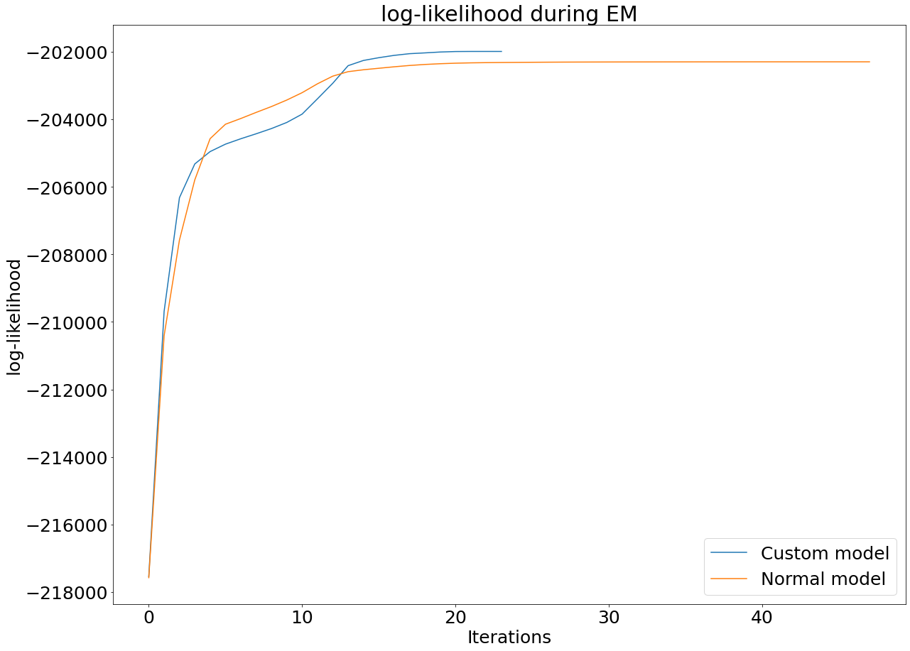

# RANDOM FOREST-HIDDEN MARKOV MODEL

This package provides an implementation of our algorithm **RF-HMM**. First, our algorithm will execute the Expectation-Maximization algorithm using hmmlearn and then we boost
the gamma probabilities to reach a better likelihood with the time series. The boosting use a random-forest where the inputs are the raw data and the outpus are their corresponding hidden states. So the random-forest is doing a classification among the data. A threshold is given by the user and we build the training dataset for the random-forest with data where a probability to be in a hidden state is higher than the given threshold. In our case, we fixed this value at 0.7 and after the training, we save the output for the others data which give us a distribution of probabilities to be in each hidden state. All of this allow us to build our boosted parameters which correspond to the gamma probabilities predicted by the random forest.

If your time series is in high dimension (more than 4), we recommand to use the class **Encoder-RF-HMM**
where the data are compressed by an encoder before starting to train the RF-HMM. Indeed, the RF-HMM provides poor result in high dimension. And finally if you want to make 
prediction, you are invited to use the class **RF-HMM-LSTM** where an LSTM can be trained on your hidden states to make prediction.

## Usage

Let's instance your RF-HMM model :

~~~
model=RF_HMM(n_components, threshold=0.7)
~~~

where ``n_components`` correspond to the wished number of hidden states and ``threshold`` is a value to build the training set for the random forest. Then you can train your model
on your time series as below :

~~~
model.train(time_series, display=True)
~~~

By selecting the ``display`` option you can see the evolution of the likelihood during iterations. Finally, you can evaluate your model on new data from your time series :

~~~
predicted_probs, predicted_states, predicted_means=model.eval(new_data)
~~~

where ``predicted_probs`` is an array of probabilities to be in each hidden states at any times, ``predicted_states`` is an array which show for each elements its corresponding state and ``predicted_means`` is an array of means of the gaussian law at any times. The others classes are quite similar, they dispose of a ``train`` method and a ``predict``method.

## Example

We worked on a problem of forecasting the price of a stock exchange. Our approach was to find hidden states to build a better understanding signal instead of only working with a noisy signal (the price). You can find below a comparaison between the obtained likelihood with a simple use of hmmlearn and the obtained likelihood with our custom model being a ``RF_HMM`` instance :

The class ``RF_HMM_LSTM`` allowed us to make better prediction instead only using an hidden markov model with gaussian emissions and make the inference with the transition matrix.
